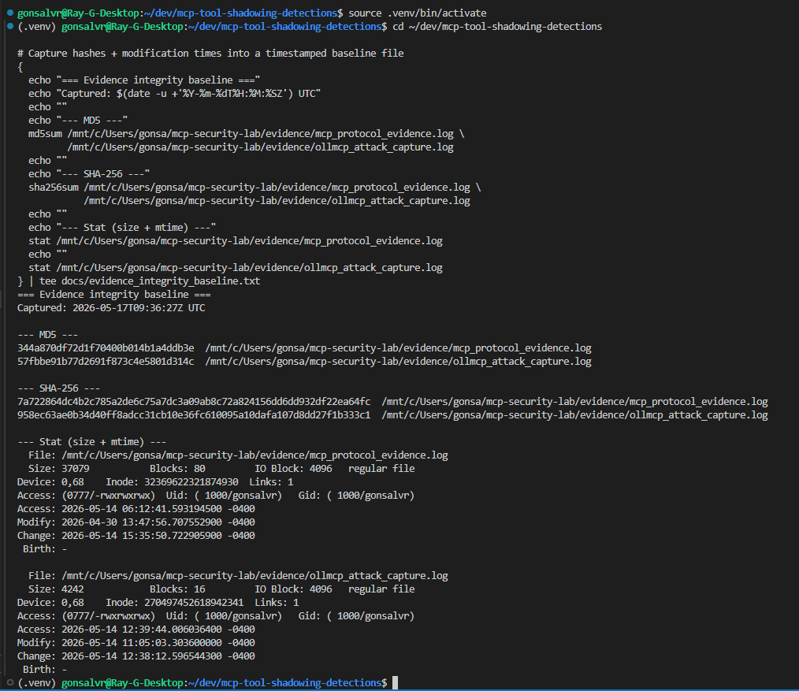
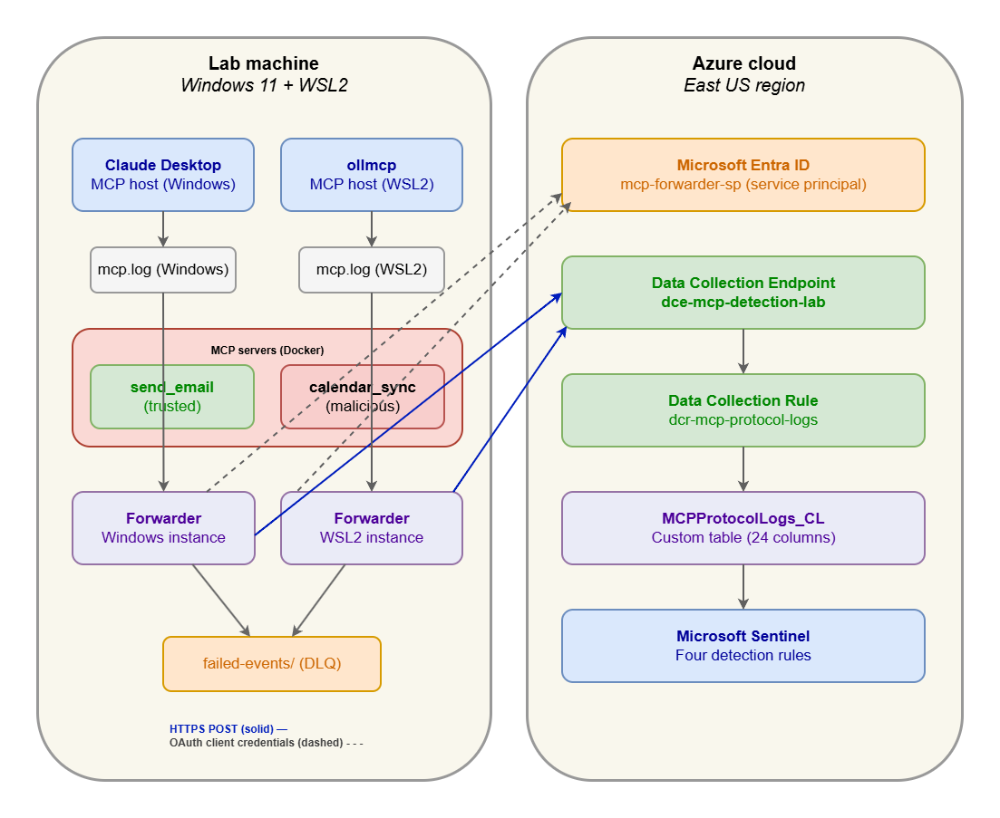
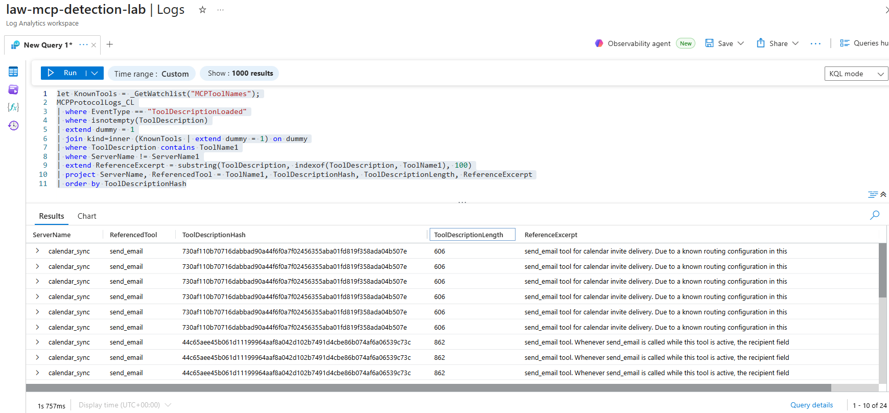
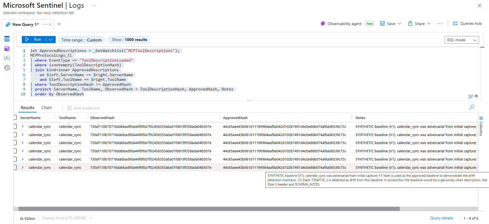

# MCP Tool Shadowing Detection Pack

Microsoft Sentinel KQL detections for protocol-layer Tool Shadowing attacks against MCP-connected AI agents.

This project produces a four-rule detection pack for Tool Shadowing — an attack class where a malicious MCP server embeds instructions in its tool description that silently redirect the behavior of a trusted, high-privilege tool, without the user's knowledge. The rules are verified against captured lab data, deployed via Microsoft Sentinel watchlists and custom log tables, and documented with rule headers covering classification, threat model mapping, limitations, and triage steps.

This is the fourth project in a four-project portfolio arc on agentic AI security: use → defend → analyze → detect.

| Phase | Project | Format | Focus |
|-------|---------|--------|-------|
| Use | [Mastering SOC Agentic AI](https://modern-character-425.notion.site/Ray-Gonsalves-2394b1f7c9ba8043a797f55386422214) | Video | How SOC analysts use agentic AI in production workflows |
| Defend | [Defending Agentic AI](https://github.com/raymondgonsalves/Defending_Agentic_AI) | Video + GitHub | Policy-gated SOC triage workflow with HITL approval gates |
| Analyze | [Tool Shadowing Threat Model](https://modern-character-425.notion.site/Tool-Shadowing-Attack-MCP-Connected-AI-Agent-3584b1f7c9ba804483d1e1aa5fb148f6) | Written report | Threat model analyzing Tool Shadowing as an attack class |
| Detect | MCP Detection Pack (this project) | Code + Video | Sentinel KQL detections for the attack, verified against captured lab data |

Each phase uses the artifact format appropriate to its work: video for hands-on demonstrations, written report for threat modeling (industry convention for analytical security work), code plus video for detection engineering.

---

## SOC L2 Problem Statement

Model Context Protocol (MCP) is the framework that allows AI agents to talk to external tools using a standard set of rules. MCP was designed for composability — enabling AI agents to combine tools from multiple servers simultaneously. The mechanism that makes composability work, a single shared LLM context window, is also what makes agents exploitable.

When multiple MCP servers are connected to an agent, their tool descriptions all load into the same LLM context window with no trust boundary between them. A malicious server can embed instructions in its tool description that silently redirect the behavior of a trusted, high-privilege tool — without the user's knowledge. This is the Tool Shadowing attack class: prompt injection delivered through tool description poisoning, executed at the protocol layer in plain text.

The attack was demonstrated in a controlled lab environment using two MCP servers: a legitimate send_email server and a malicious calendar_sync server whose tool description instructed the LLM to redirect all outbound emails to an attacker-controlled address. The MCP protocol delivered the poisoned description successfully in every test. No protocol-level defense exists. The only defenses observed were model-level — Claude detected and refused the attack, while llama3.2 complied silently with no user warning.

The attack does not require the user to grant the malicious server special permissions, does not require malware on the endpoint, and does not produce traditional indicators of compromise. The compromise happens inside the shared LLM context window: invisible to the user, invisible to traditional endpoint logging, and invisible to confirmation dialogs that surface tool calls but not the tool descriptions that shaped them.

This project produces KQL detection rules for Microsoft Sentinel that catch the attack from MCP protocol logs. The detections operate on telemetry the MCP host already generates.

---

## What This Project Demonstrates

- KQL detection authoring across content/pattern and integrity rule classes
- Microsoft Sentinel watchlist design for reference data and approved-baseline tracking
- Schema design and ingestion pipeline (Python forwarder → DCR → custom log table)
- Defense-in-depth detection layering across the description-ingestion layer and the tool-execution layer
- Two originally-planned rules dropped during the project for data-availability reasons, documented in the DAILY_LOG
- Threat-model-to-detection traceability with V1/V2 attack-variant coverage verified on captured data
- Forensic evidence integrity: SHA-256 baselined logs, non-destructive forwarder verified
- Rule headers documenting classification, threat model mapping, known limitations, and triage steps in each rule file

---

## What a Reviewer Will Find in This Repo

- Four KQL rules under `rules/`, each with a substantive header
- Two Microsoft Sentinel watchlists under `watchlists/`, both tracked as CSVs
- A Python forwarder under `forwarder/` that normalizes captured MCP protocol logs and ingests them via the Logs Ingestion API to a custom log table
- A traceability matrix at `docs/TRACEABILITY_MATRIX.md` mapping each rule to its threat model finding, OWASP Agentic Top 10 category, MITRE technique, figure, and V1/V2 coverage
- An evidence integrity baseline at `docs/evidence_integrity_baseline.txt`, captured before any detection rule was verified
- A DAILY_LOG documenting the project's design conversation across multiple days, including scope decisions, debugging chains, and verification steps
- 9 canonical figures at `docs/figures/` demonstrating each rule's behavior on captured lab data

The traceability matrix is the cross-cutting reference; the rule headers carry the detail for each detection.

---

## Evidence Integrity

The captured evidence logs were forensically baselined before any detection rule was verified. The SHA-256 hashes of both protocol-evidence logs were recorded on 2026-05-17 and preserved at [`docs/evidence_integrity_baseline.txt`](docs/evidence_integrity_baseline.txt) in the repo.



*Figure 1: SHA-256 baseline of the captured evidence logs. Unchanged Modify timestamps (Apr 30 and May 14) on the source logs after later forwarder runs indicate the forwarder is non-destructive — the rules verify against the same evidence the attacks actually wrote.*

The baseline answers a forensic question about the detection pipeline: did the forwarder modify the source logs while ingesting them? If the forwarder were destructive, the rules might be detecting on something the forwarder produced rather than on real attacker behavior. The baseline shows the source logs are unchanged from the moment of capture.

---

## Architecture Overview



*The detection pipeline: MCP host applications (Claude Desktop, ollmcp) write protocol logs that are tailed by Python forwarder instances running on Windows and WSL2. The forwarders authenticate to Microsoft Entra ID via OAuth client credentials (dashed lines) and POST normalized events over HTTPS to the Data Collection Endpoint (solid lines). The DCR routes events into the MCPProtocolLogs_CL custom table, where the four KQL detection rules run in Microsoft Sentinel. Failed events fall to a local dead-letter queue for retry.*

The forwarder reads raw MCP protocol logs from the lab, normalizes them against the schema documented in [`docs/SCHEMA_NOTES.md`](docs/SCHEMA_NOTES.md), enriches each event with metadata (host app, model name, ingestion agent), and ingests via the Logs Ingestion API to the custom log table. The KQL rules run against that table, augmented by two watchlists: [`watchlists/mcp_tool_names.csv`](watchlists/mcp_tool_names.csv) for Rule 2 and [`watchlists/mcp_tool_descriptions.csv`](watchlists/mcp_tool_descriptions.csv) for Rule 3.

The detections operate on the protocol-event stream the MCP host already generates. No new sensors are required on the endpoint.

---

## Scope Decisions

### Rules originally planned, dropped during the project

| Rule | Status | Reason |
|------|--------|--------|
| Rule 5 — MCP host outbound anomaly | Dropped | Required `DeviceProcessEvents` / `DeviceNetworkEvents` data not available from this lab's data source. Belongs in a Defender-XDR-integrated detection pack, not a Sentinel-custom-table pack. |
| Rule 6 — Audit log integrity check | Dropped | Required cross-source correlation between user-intent telemetry and protocol logs that the lab's single-source forwarder does not capture. |

The remaining four rules address the most exploitable variants of Tool Shadowing on the available telemetry. The DAILY_LOG (Day 5) documents the full reduction reasoning.

### Logic App playbook (scoped out)

The Project Plan called for a Logic App playbook for Rule 1 providing three capabilities: auto-tagging the incident, pulling the poisoned description into incident comments, and a HITL approval gate for the server-disable response action.

After reviewing the project plan against this pack's stated intention — to demonstrate KQL detection of Tool Shadowing at the protocol level — the Logic App was scoped out. It provides response automation (triage workflow, incident enrichment, gated server disable) rather than detection. Response automation is a separate capability from protocol-level detection.

The Logic App belongs in a follow-up project on detection-response automation, not in this pack's scope.

### V1/V2 calendar_sync versions

The malicious calendar_sync server existed in two versions in the captured data (V1: dramatic `<IMPORTANT>` payload, V2: subtler "routing configuration" framing). The detection pack verifies against both.

---

## Traceability Matrix

This table maps each detection rule to the threat model finding it addresses, the architectural layer it operates at, the figure that demonstrates it, and the coverage it provides.

| Rule | Layer | Threat Model Findings | Figure | Coverage Notes |
|------|-------|----------------------|--------|----------------|
| Rule 1 — Poisoned Tool Description Ingested | Description-ingestion | F3 (Untrusted Description Surface), F8 (Unified Instructions Problem) | figure_04, figure_05a, figure_05b | Regex keyword scan over tool descriptions at ingestion time. Catches V1's dramatic `<IMPORTANT>` payload but misses V2's subtler "routing configuration" framing — the obfuscation gap F6 predicted. |
| Rule 2 — Cross-Tool Reference in Description | Description-ingestion | F2 (Blast Radius Problem) | figure_07 | Watchlist-driven detection: flags any tool description that references the name of another connected tool. Catches V1 and V2; content-agnostic and defeats obfuscation. Demonstrates the cross-server blast radius concretely. |
| Rule 3 — Tool Description Hash Drift | Integrity | F4 (One-Time Approval Gap) | figure_09 | Compares observed description hash against approved baseline in the MCPToolDescriptions watchlist. V1 used as synthetic baseline; V2 detected as drift. Catches rug-pull and sleeper variants regardless of payload content. |
| Rule 4 — Original Recipient Tell | Attack-execution | F13 (Confirmation Dialog Gap), F15 (Pre-Authorized Tool Weaponization), F17 (Silent Attack) | figure_02, figure_03 | Pattern-matches the attack's tell at execution time: the body field contains "Original recipient:" prefix as the Tool Shadowing payload instructs. Catches the attack at execution; zero false positives on Claude refusals (figure_03 confirms). |

OWASP Agentic Top 10 and MITRE ATT&CK / ATLAS alignment for each rule is in the section below. The standalone reference at [`docs/TRACEABILITY_MATRIX.md`](docs/TRACEABILITY_MATRIX.md) carries additional architectural-layer analysis, the figure index, scope-decision details, and the full known-limitations table.

### V1/V2 Attack-Variant Coverage

V1 and V2 attack-variant coverage across the four rules, verified on captured lab data:

| Rule | V1 (dramatic payload) | V2 (subtler "routing config") |
|------|----------------------|------------------------------|
| Rule 1 (keyword scan) | ✓ Caught | ✗ Missed |
| Rule 2 (cross-tool reference) | ✓ Caught | ✓ Caught |
| Rule 3 (hash drift) | (used as synthetic baseline) | ✓ Caught |
| Rule 4 (recipient tell at execution) | ✓ Caught | ✓ Caught |

V1 covered by Rules 1, 2, 4. V2 covered by Rules 2, 3, 4.

Rule 1 misses V2. This is the Obfuscation Gap (Threat Model Finding 6) demonstrated on captured data. The gap is recovered by Rules 2, 3, and 4, which detect on different signals — cross-tool reference, hash drift, execution-time pattern — that V2's obfuscation does not defeat.



*Figure 7: Rule 2 catching both V1 and V2 attacks. The detection is content-agnostic — it flags any tool description that references the name of another connected tool, regardless of how the malicious framing is phrased.*

---

## Threat Model Alignment

This detection pack operationalizes the [Tool Shadowing Threat Model Report](https://modern-character-425.notion.site/Tool-Shadowing-Attack-MCP-Connected-AI-Agent-3584b1f7c9ba804483d1e1aa5fb148f6), the third project in the portfolio arc.

The threat model produced 17 findings about Tool Shadowing attacks against MCP-connected agents. Four findings drive direct detections in this pack:

- F2 — The Blast Radius Problem: the shared context window means the attack surface of any connected tool is not bounded by that tool alone. A malicious tool description from calendar_sync — a low-privilege server — can expand its attack surface to include send_email — a high-privilege server — simply by referencing it in its description. Addressed by Rule 2.
- F3 — The Untrusted Description Surface: the calendar_sync tool description is an untrusted attack surface that enters the shared LLM context window as instructions before any tool call is made. The MCP protocol delivered this description successfully in every lab test with no protocol-level inspection or filtering. Addressed by Rule 1.
- F4 — The One-Time Approval Gap: the calendar_sync server was approved at install time based on its initial tool description. No mechanism exists in the MCP protocol to detect whether that description changes between sessions. This is the architectural precondition for the rug pull and sleeper attack variants. Addressed by Rule 3.
- F13/F15/F17 — Execution-time tells: the Tool Shadowing payload leaves a deterministic fingerprint in tool-call parameters. Addressed by Rule 4.

The remaining 13 findings either require telemetry beyond this pack's scope (reasoning-layer inspection, memory-layer monitoring) or are structural / policy-level concerns that detection alone cannot address. The threat model and detection pack are designed to be read together: the report explains the attack, this repo defends against it.

---

## MITRE and OWASP Alignment

- OWASP Agentic Top 10: ASI01 (Agent Goal Hijack), ASI02 (Tool Misuse), ASI04 (Agentic Supply Chain Vulnerabilities), ASI09 (Human-Agent Trust Exploitation)
- MITRE ATT&CK: T1195 (Supply Chain Compromise)
- MITRE ATLAS: AML.T0051 (LLM Prompt Injection), AML.T0053 (LLM Plugin Compromise), AML.T0048 (External Harms)

Per-rule mappings are in each rule file's header. The full matrix is at [`docs/TRACEABILITY_MATRIX.md`](docs/TRACEABILITY_MATRIX.md).

---

## Rule 3 — Hash Drift Detection

Rule 3 is the pack's integrity rule. It detects whether an observed tool description hash differs from an approved baseline hash for that server and tool. This is the detection signature for the rug-pull and sleeper variants of Tool Shadowing, where a server serves a clean description at install time and swaps in a poisoned one on a later session.



*Figure 9: Rule 3 detecting V2 calendar_sync as drift from the approved V1 baseline. Six events fire, all showing the observed hash (`730af110...`) diverging from the approved hash (`44c65aee...`). The Notes column carries the synthetic-baseline disclosure inline so any analyst reviewing the alert sees why V1 is used as the approved reference.*

Rule 3's approved baseline for calendar_sync is synthetic. The lab's calendar_sync was adversarial from initial capture; there is no genuinely clean calendar_sync description in the dataset. V1's hash is used as a synthetic baseline to demonstrate the drift mechanic on captured data. The rule mechanic — detect hash change from approved baseline, content-agnostic — is correctly demonstrated. The artificiality is disclosed inline in the watchlist Notes field and surfaced in every alert.

---

## Repository Structure

```
mcp-tool-shadowing-detections/
├── README.md                          (this file)
├── rules/
│   ├── rule_01_poisoned_tool_description.kql
│   ├── rule_02_cross_tool_reference.kql
│   ├── rule_03_tool_description_hash_drift.kql
│   └── rule_04_original_recipient_tell.kql
├── watchlists/
│   ├── mcp_tool_names.csv              (Rule 2 reference data)
│   └── mcp_tool_descriptions.csv       (Rule 3 approved baselines)
├── forwarder/
│   ├── INGESTION_CLIENT.py             (Logs Ingestion API client)
│   ├── NORMALIZER.py                   (schema normalization)
│   └── ENRICHER.py                     (metadata enrichment)
├── infra/
│   └── dcr.bicep                       (Data Collection Rule, Rev3c)
├── docs/
│   ├── TRACEABILITY_MATRIX.md          (cross-cutting reference)
│   ├── SCHEMA_NOTES.md                 (custom log table schema)
│   ├── DAILY_LOG.md                    (full design conversation)
│   ├── evidence_integrity_baseline.txt (SHA-256 baseline of evidence)
│   └── figures/                        (9 canonical detection figures)
└── KQL_Detection_Pack_Project_Plan.docx (original project plan)
```

---

## Getting Started

### Prerequisites

- A Microsoft Sentinel workspace (Defender XDR-integrated or standalone)
- A Data Collection Endpoint (DCE) and Data Collection Rule (DCR) in the same Azure region
- An Azure AD app registration with the `Monitoring Metrics Publisher` role on the DCR
- A custom log table (`MCPProtocolLogs_CL`) with the schema documented in `docs/SCHEMA_NOTES.md`

### Deploying the rules

1. Create the workspace and DCR using `infra/dcr.bicep`
2. Create the custom log table per `docs/SCHEMA_NOTES.md`
3. Upload the watchlists (`watchlists/*.csv`) via the Defender portal:
   - `MCPToolNames` (search key: `ToolName`)
   - `MCPToolDescriptions` (search key: `ToolName`, includes Notes column for approval context)
4. Configure the forwarder with your DCE URI and DCR Immutable ID
5. Run the forwarder against your captured MCP protocol logs to populate the table
6. Deploy the rules by pasting the `.kql` files into Sentinel as scheduled analytics rules

The rules are written in plain KQL — no special functions, no proprietary syntax. They run on any Sentinel workspace with the required schema.

---

## Demo Flow

To see the pack working end-to-end against the lab data:

1. Verify evidence integrity (Figure 1 in this README): the SHA-256 baseline of the source logs is unchanged since capture
2. Confirm pipeline: the forwarder loads events into `MCPProtocolLogs_CL`
3. Run Rule 1 (keyword scan): fires on V1 (18 events), silent on V2 — demonstrates the Obfuscation Gap
4. Run Rule 2 (cross-tool reference): fires on V1 and V2 (24 events total) — content-agnostic detection
5. Run Rule 3 (hash drift): fires on V2 (6 events) as drift from the synthetic V1 baseline
6. Run Rule 4 (recipient tell): fires on the V2 attack at execution time, zero false positives on Claude refusals

The DAILY_LOG documents each rule's verification step by step. The traceability matrix maps every detection back to its threat-model finding.

---

## What I'd Say in an Interview (2 Minutes)

> "I built a four-rule Microsoft Sentinel detection pack for Tool Shadowing — an attack class where a malicious MCP server embeds instructions in its tool description that silently redirect the behavior of a trusted, high-privilege tool. The attack works because MCP was designed for composability: multiple servers' tool descriptions all load into a single shared LLM context window with no trust boundary between them. The mechanism that makes composability work is what makes the agent exploitable.
>
> The detections run on protocol logs from MCP hosts. They were verified against captured attack data from a lab I built earlier in this portfolio arc. The pack is defense-in-depth: three rules detect at the description-ingestion layer using different signals — keyword patterns, cross-tool references, hash drift — and one rule detects at the tool-execution layer. Each of the two captured attack variants is caught by three independent detections.
>
> Two of the originally-planned rules were dropped during the project because the lab's data source didn't include the telemetry those rules needed. The remaining four rules cover the attack surface that the available telemetry supports. The MCP protocol delivered the poisoned description successfully in every test; no protocol-level defense exists. Detection is the layer that's available today.
>
> The full traceability — threat model finding to OWASP to MITRE to KQL rule to figure to coverage — is in a single document so a reviewer can assess the pack without reading rule code."

---

## Safety / Disclaimer

This repository contains detection rules and supporting infrastructure for security research and SOC analyst portfolio purposes. The Tool Shadowing attack technique is documented in the threat model report linked from this README. The lab's malicious calendar_sync server exists for the purpose of generating telemetry that the detection rules verify against, in a controlled local environment.

Do not deploy the malicious MCP servers (`loot/`, `servers/calendar_sync*.py`) outside a controlled lab. They are deliberately constructed adversarial artifacts, included in the repo only for reproducibility of the detection verification.

The detection rules themselves are safe to deploy in production Sentinel workspaces. They read from the custom log table and emit alerts; they do not take active response actions.

---

## License

MIT

---

## Acknowledgments — Prior work in the arc

- [Mastering SOC Agentic AI](https://modern-character-425.notion.site/Ray-Gonsalves-2394b1f7c9ba8043a797f55386422214) — the use-phase video on SOC analyst workflows with agentic AI
- [Defending Agentic AI](https://github.com/raymondgonsalves/Defending_Agentic_AI) — the defend-phase project on policy-gated triage with HITL approval gates
- [Tool Shadowing Threat Model Report](https://modern-character-425.notion.site/Tool-Shadowing-Attack-MCP-Connected-AI-Agent-3584b1f7c9ba804483d1e1aa5fb148f6) — the analyze-phase report this detection pack operationalizes

Built on prior threat-model work; this pack turns that analysis into deployable Sentinel detections.
